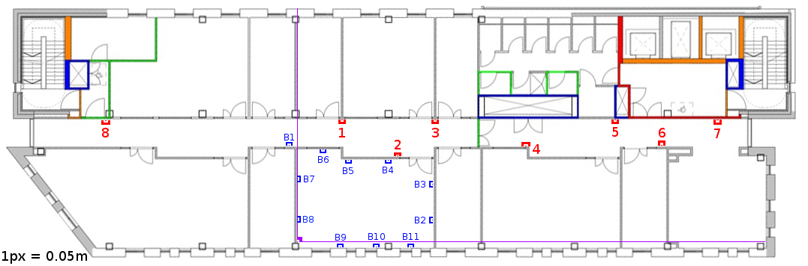

## Raw Signal Data

```{r, echo=FALSE, fig.cap="Raw Signal Data", message = FALSE, fig.height=6}
setwd("/Users/jonny/Documents/Study/locationcode/SpatialStatistics/")
source("ExploratoryDataAnalysis.R")
p1
```

## Filtered Signal Data

```{r, echo=FALSE, fig.cap="Raw signal (top) Median Filtered Signal (bottom)", message=FALSE, fig.height=6}
library(gridExtra)
grid.arrange(p1,p2)
```

## Estimote Locations



## Prediction Using Naïve Bayes
Given a vector of RSS measurements from $n$ estimotes, $\textbf{s} = (s_1, \dots, s_n)^T$ we want to predict a location $\textbf{x} = (x, y)^T$, using Bayes theorem:

$$ P(\textbf{x}|\textbf{s}) = \frac{P(\textbf{s}|\textbf{x})P(\textbf{x})}{\int P(\textbf{s}|\textbf{x}) P(\textbf{x}) d\textbf{x}}. $$

Initially all locations are assumed to be equally probable (since we aren't considering time) so the prior probability $P(\textbf{x})$ is uniform. The observed RSSI values $\textbf{s}$ are conditionally independent for a given position $\textbf{x}$ which means the above equation can be written as:

$$ P(\textbf{x}|\textbf{s}) = \frac{\prod_{i=1}^n P(s_i|\textbf{x})}{\int P(\textbf{s}|\textbf{x}) d\textbf{x}}. $$

## Accuracy of Naïve Bayes

- Coming soon
- Works well in just a corridor!

## Constructing a Radio Map

```{r, fig.cap="Count of Measurements taken at each point for Estimote A2 and average RSSI Value", echo=FALSE, message = FALSE, fig.height=6}
library(tidyr)
library(geoR)

# Chop into a square
medianFiltered = medianFiltered %>% filter(x <= 10 & x >= 0)

# Set up a prediction grid
x = medianFiltered$x
y = medianFiltered$y
locs = as.matrix(expand.grid(seq(min(x), max(x), l = 21), seq(min(y), max(y), l = 21)))

# Exploring RSSI measurements at points
tmpdf = medianFiltered %>% 
         group_by(x, y, address) %>% 
         summarise(RSSI = mean(median), count = n()) %>% 
         filter(address == "A2" & count > 10)

p1 = ggplot(tmpdf, aes(x = x, y = y, size = RSSI)) + geom_point()
p2 = ggplot(tmpdf, aes(x = x, y = y, size = count)) + geom_point()

grid.arrange(p1, p2)
```

## Constructing a Radio Map

```{r, fig.cap="Measurement map for Estimote A2", echo=FALSE, message = FALSE, warning=FALSE}
geoData = medianFiltered %>% 
  group_by(x, y, address) %>% 
  summarise(RSSI = mean(median), count = n()) %>% 
  filter(address == "A2" & count > 10) %>%
  spread(address, RSSI) %>%
  as.geodata(coords.col = 1:2, data.col = 4)

par(mfrow = c(1,1))
vario = variog(geodata = geoData, uvec = 20, messages = FALSE)
var.fit = variofit(vario, ini.cov.pars = c(100, 10), cov.model = "matern", kappa = 0.5, messages = FALSE)

krig = krige.conv(geodata = geoData, loc = locs, krige = krige.control(type = "sk", obj.mod = var.fit), output = list(messages = FALSE))
par(mfrow = c(1,2))
image(krig, col = gray(seq(0, 1, l = 51)))
contour(krig, add = TRUE)
image(krig, values = sqrt(krig$krige.var), col = gray(seq(0, 1, l = 51)))
```

## Prediction using the Radio Map

Given a vector of RSS measurements from $n$ estimotes, $\textbf{s} = (s_1, \dots, s_n)^T$ we want to predict a location $\textbf{x} = (x, y)^T$, using Bayes theorem:

$$ P(\textbf{x}|\textbf{s}) = \frac{P(\textbf{s}|\textbf{x})P(\textbf{x})}{\int P(\textbf{s}|\textbf{x}) P(\textbf{x}) d\textbf{x}}. $$

Initially all locations are assumed to be equally probable (since we aren't considering time) so the prior probability $P(\textbf{x})$ is uniform. The observed RSSI values $\textbf{s}$ are conditionally independent for a given position $\textbf{x}$ which means the above equation can be written as:

$$ P(\textbf{x}|\textbf{s}) = \frac{\prod_{i=1}^n P(s_i|\textbf{x})}{\int P(\textbf{s}|\textbf{x}) d\textbf{x}}. $$