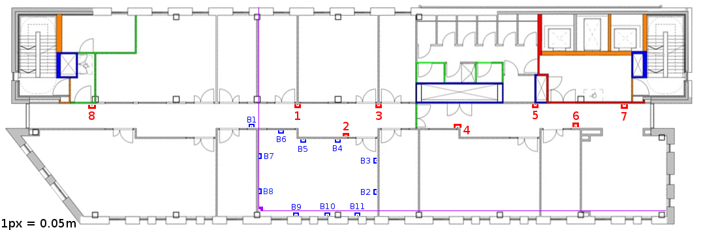

## Motivation

- GPS doesn't work through roofs

## Motivation


## Motivation


## The Estimote


## The Android App


## Collecting The Data



## Trilateration


## Triangulation


## Fingerprinting

- Recording the received RSSI at survey sites
- Currently the most accurate in the literature

## Fingerprinting


## Raw Signal Data

```{r, echo=FALSE, fig.cap="Raw Signal Data", message = FALSE, fig.height=6}
setwd("/Users/jonny/Documents/Study/locationcode/SpatialStatistics/")
source("ExploratoryDataAnalysis.R")
p1
```

## Filtered Signal Data

```{r, echo=FALSE, fig.cap="Raw signal (top) Median Filtered Signal (bottom)", message=FALSE, fig.height=6}
library(gridExtra)
grid.arrange(p1,p2)
```

## Algorithms

> - K-NN
> - Naïve Bayes
> - Particle Filter
> - Kalman Filter
> - Gaussian Process Regression

## Classifying Points

